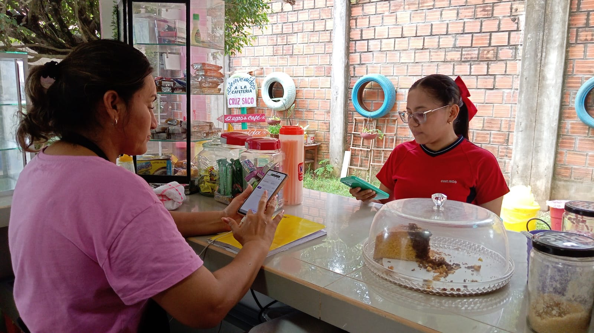

# ☕ Cafetín — API Web

> **Cafetín API** es el backend web del ecosistema Cafetín: recibe los datos sincronizados desde la app Android, los persiste en una base SQLite por dispositivo, y los expone al dashboard mediante endpoints protegidos por sesión QR.

---

## 📋 Gestión del Proyecto

La planificación, seguimiento de tareas y gestión del desarrollo se realizan mediante Trello.

[](https://trello.com/b/RlwsrY03/cafetin-gestion-de-fiados)

🔗 Tablero del proyecto: https://trello.com/b/RlwsrY03/cafetin-gestion-de-fiados

---

## 1. Descripción del Negocio

**Cafetín escolar** es un negocio de pequeña escala que gestiona fiados entre alumnos y la persona encargada de la tienda. El registro de deudas, pagos y movimientos se realiza desde la app Android **Cafetín**, que opera 100% offline en el dispositivo.

Esta API complementa la app ofreciendo:
- **Sincronización de datos** — recibe los datos que sube la app y los guarda en el servidor.
- **Autenticación por QR** — permite iniciar sesión en el dashboard escaneando un código QR desde la app, sin contraseñas.
- **Dashboard de solo lectura** — cualquier navegador puede consultar clientes, fiados e historial una vez autenticado.

---

## 2. Identificar el Problema y Solución

### Problema

- Los datos de la app solo son visibles desde el dispositivo Android donde está instalada.
- No existe forma de consultar el estado de los fiados desde una computadora u otro dispositivo.
- Revisar el historial o los saldos fuera del teléfono requiere acceso físico al mismo.

### Solución Propuesta

Una **API web en PHP** desplegada en Railway que:
1. Recibe los datos de la app (personas, movimientos, catálogo) como JSON y los persiste en un SQLite por dispositivo.
2. Genera tokens QR temporales que la app puede escanear para autenticar una sesión web.
3. Expone endpoints de solo lectura protegidos por sesión, que el dashboard HTML/JS consume.

> **Regla de oro:** Los datos solo se registran desde la app Android. La API nunca escribe datos desde el dashboard.

---

## 3. Preanálisis

### Necesidades

- Recibir y almacenar los datos enviados periódicamente por la app Android.
- Permitir al encargado iniciar sesión en el dashboard escaneando un QR con la app.
- Consultar la lista de clientes y su saldo actual de fiado.
- Ver el detalle de movimientos (fiados y pagos) por cliente.
- Revisar el historial de movimientos por fecha.
- Consultar el catálogo de productos y categorías disponibles.

### Estudio de Viabilidad

| Aspecto | Evaluación |
|---|---|
| Técnica | Viable. PHP con SQLite y sin frameworks, deployable en Railway con FrankenPHP. |
| Operativa | Viable. La API sigue la estructura de datos ya definida por la app. |
| Económica | Viable. Railway ofrece tier gratuito suficiente para el volumen del negocio. |
| Tiempo | Viable. El alcance está ajustado a las entidades ya modeladas en la app. |

### Alcance del Sistema

**Incluye:**
- Recepción y persistencia de datos desde la app (sync JSON)
- Autenticación sin contraseña mediante QR (tokens efímeros)
- Consulta de clientes y sus saldos (dashboard protegido)
- Consulta de movimientos por cliente
- Consulta del historial por fecha
- Consulta del catálogo (categorías y productos)
- Dashboard HTML/JS con polling automático de cambios

**No incluye:**
- Registro, edición ni eliminación de datos desde el dashboard
- Gestión de múltiples usuarios o roles
- App móvil propia

---

## 4. Análisis

### Definición de Requisitos

#### Requisitos Funcionales

| ID | Descripción |
|---|---|
| RF01 | La API debe recibir un payload JSON con personas, movimientos, categorías y productos, y persistirlos en un SQLite por dispositivo. |
| RF02 | La API debe generar tokens QR temporales (TTL 5 min) para iniciar sesión. |
| RF03 | La app Android puede confirmar un token QR; el servidor crea una sesión de 24 h. |
| RF04 | El dashboard puede hacer polling para verificar si un token fue confirmado y obtener la sesión. |
| RF05 | Los endpoints de datos (personas, movimientos, catálogo) deben requerir sesión activa (`Authorization` header). |
| RF06 | La API debe retornar la lista de clientes con su saldo calculado. |
| RF07 | La API debe retornar todos los movimientos, filtrables por `personaId` o por fecha. |
| RF08 | La API debe retornar las categorías del catálogo con sus productos anidados. |

#### Requisitos No Funcionales

| ID | Descripción |
|---|---|
| RNF01 | Las respuestas deben estar en formato JSON UTF-8. |
| RNF02 | La API debe responder en menos de 2 segundos por consulta. |
| RNF03 | El upload debe autenticarse con una API key fija (`X-Api-Key`). |
| RNF04 | Cada dispositivo Android tiene su propio SQLite identificado por `X-Device-Id`. |
| RNF05 | Debe funcionar en Railway con FrankenPHP (sin mod_rewrite; rutas vía `?_route=`). |

### Análisis de Requisitos

El flujo de uso del sistema completo es:

```
App Android sincroniza datos
    → POST /upload  (X-Api-Key + X-Device-Id + JSON)
    → Servidor crea/actualiza cafetin_db_{deviceId}

Encargado quiere ver el dashboard
    → Abre login.html en el navegador
    → El servidor genera un token QR (GET /auth/generar)
    → El encargado escanea el QR con la app
    → La app confirma el token (POST /auth/confirmar)
    → El dashboard hace polling (GET /auth/verificar)
    → Obtiene la sesión y redirige al dashboard

Encargado navega el dashboard
    → GET /personas, /movimientos, /catalogo  (Authorization: sesion)
    → El dashboard actualiza datos en background cada 30 s (live-poll)
```

Los actores del sistema son:

| Actor | Rol en el sistema |
|---|---|
| **Encargado** | Escanea el QR para autenticarse; consulta datos desde el dashboard. |
| **App Android** | Sube datos al servidor; confirma tokens QR. |
| **Dashboard** | Interfaz web de solo lectura que consume los endpoints protegidos. |

---

## 5. Uso del Software en el Negocio

> 

---

## Tecnologías

| Capa | Tecnología |
|---|---|
| Backend / API | PHP 8.x (sin frameworks) |
| Base de datos | SQLite por dispositivo (PDO) |
| Servidor | Railway + FrankenPHP |
| Autenticación | Tokens QR efímeros + sesiones (JSON en `/tmp`) |
| Dashboard | HTML + CSS + JS vanilla (sin frameworks) |
| Iconos | Lucide Icons (CDN) |
| Generación QR | `qrcode.js` (canvas, client-side) |
| Formato de respuesta | JSON UTF-8 |

---

## Estado del Proyecto

🟢 **En producción** — desplegado en Railway

| Fase | Estado |
|---|---|
| Preanálisis | ✅ Completado |
| Análisis | ✅ Completado |
| Diseño | ✅ Completado |
| Desarrollo | ✅ Completado |
| Pruebas | ✅ Completado |
| Implantación | ✅ Desplegado en Railway |
| Mantenimiento | 🔄 Activo |

---

*Proyecto complementario a [Cafetín App Android](https://github.com/G0nch0TEC/App_Cafetin) — 2026*
